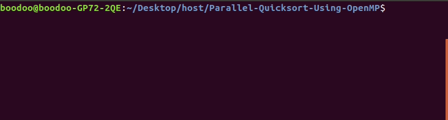

# Parallel-Quick-Sort-Using-OpenMP
Fast implementation of Quick Sort using OpenMP
## Instructions for Linux
Clone  git repository into a specific folder, then execute in bash:
```javascript
 make
````
```javascript
./qsort
````
## After executing qsort you need to insert p and q

* p - Number of threads = 2^p
* q - Number of size array n = 2^q
## Ready to go
 
## The following piece of code represents how serial Quick-Sort works:
```javascript
/* swap -- swap elements k and l of vector v */
void swap(int *v, int k, int l) {
  int temp = v[k];
  v[k] = v[l];
  v[l] = temp;
}
/* partition -- in-place update of elements */
int partition(int *v, int n) {
  int pivot = v[n-1];
  int i = 0;

  for (int j = 0; j < n - 1; j++)
    if (v[j] < pivot)
      swap(v,i++,j);

  swap(v, i, n - 1);
  return (i);
}
/* qsort_seq */
void qsort_seq(int *v, int n) {
  if (n > 1) {
    int p = partition(v, n);
    qsort_seq(v,p);
    qsort_seq(&v[p+1],n-p-1);
  }
}
```
## A brief example of Quick Sort for serial sorting:

```javascript

  int SIZE = 4096;
  int *v = malloc(SIZE*sizeof(int));
  for (int i=0; i<SIZE;i++){
    v[i] = rand() % SIZE;
  }
  qsort_seq(v,SIZE);
```

